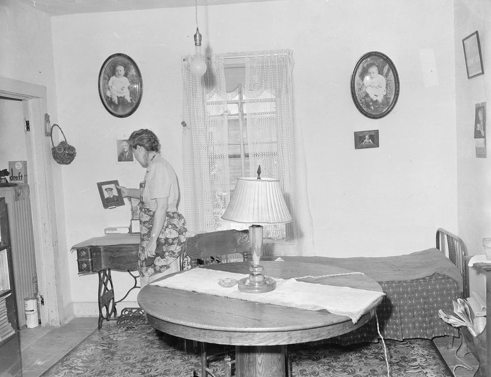
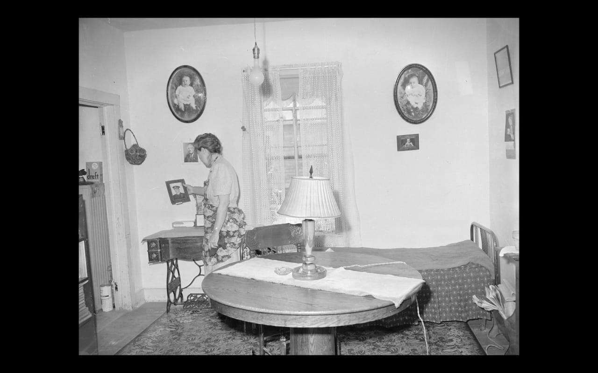
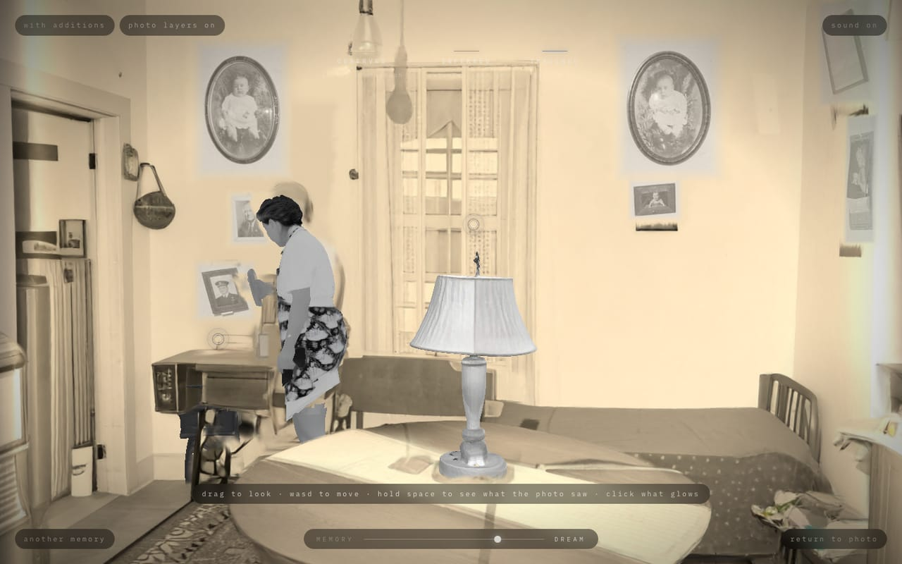
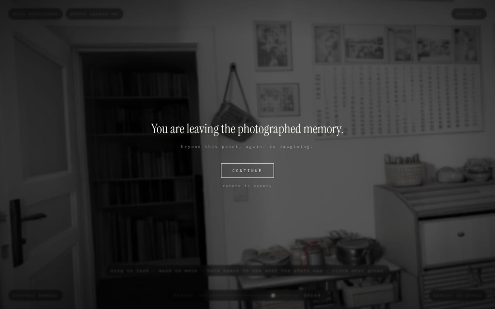
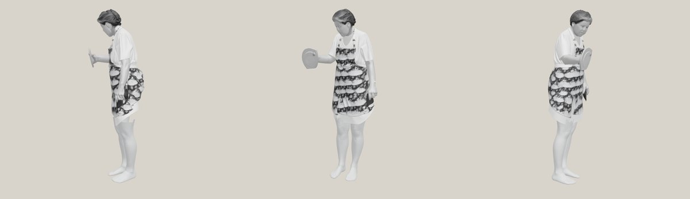
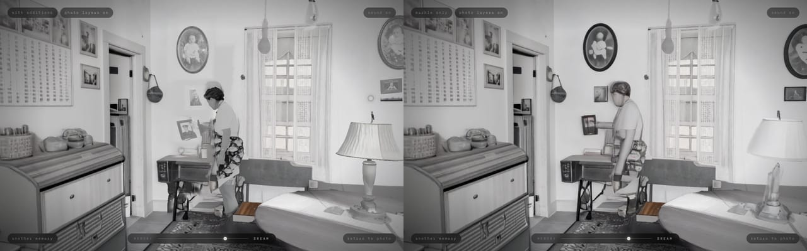
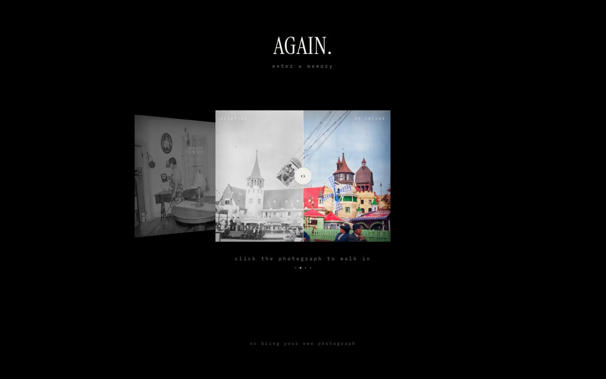
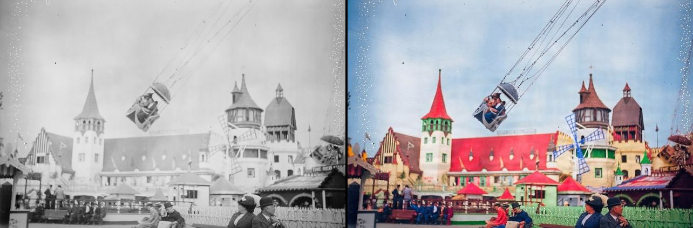

# AGAIN.

**Walk into a memory.**

AGAIN. takes an old photograph and turns it into a place you can step inside. The camera moves toward the print, passes through its surface, and you're standing in the room. You can turn around, walk to the window, pick up the lamp. Throughout, it's honest about which parts the photograph actually saw and which parts a model imagined.



*Russell Lee, 1946. A miner's wife in a coal camp in Colorado, looking at a portrait of a man in uniform. Photographed for the U.S. Coal Mines Administration (National Archives 540360, public domain). This is the first memory AGAIN. was built around.*

---

## The story

### The idea

Some photographs make you wish you could step into them: see what was just outside the frame, or stand where the photographer stood, a moment later. World models can now build a whole 3D place from a single image, and that opens a question. What if the photograph were a door?

The whole project follows from one rule: **the moment of entering matters most.** Fading between the photo and the 3D scene would feel like opening a file. AGAIN. has to feel like walking through.

### Day 1: the door (23 September 2026)

**The crossing, built first.** Everything in the first version serves the entry, in this order:

1. The photograph sits on screen as a print.
2. It's swapped, pixel for pixel, for a plane in 3D space.
3. The camera moves toward it.
4. The world opens around its feathered edges.
5. The print dissolves as the camera passes through its surface.

There are no page changes: it's one screen, driven by a state machine, so nothing ever cuts away. A mock mode came first too, so the whole experience runs with no API keys, and the tests can never spend money.



**Real photographs.** Uploads go to [World Labs Marble](https://marble.worldlabs.ai) (`marble-1.1`), which returns a Gaussian-splat world, rendered in the browser with [Spark](https://sparkjs.dev) on three.js.

- **The problem:** the crossing only works if the photograph lands exactly on its world, and Marble doesn't say where the photo's camera was.
- **The fix:** AGAIN. recovers the camera itself. It searches Marble's panorama for the field of view, pitch and yaw that best match the photograph. The 1946 room calibrates to a 45.05° field of view with a match score of 0.86.
- **The result:** a photo, its world and its camera, lined up. Every later layer (objects, faces, sound) is placed through that recovered camera.

**What's in the picture.** Gemini reads the photograph into a scene description: objects with their boxes, era, mood, the sounds the place would make, and what it isn't sure of. It never identifies people. From that description:

- **3D objects:** a few become meshes you can click, each placed exactly where the photo shows it.
- **Sound:** ElevenLabs makes a room tone and sounds that come from particular objects in the room. They're silent until you step in, faint at the threshold and full inside.

**Honesty, from the start.** A world model invents things. AGAIN. says so, per splat, on the GPU, by projecting every point back into the original camera:

- **MEMORY ↔ DREAM:** at MEMORY, anything the photograph never saw fades to a dim fog.
- **Hold Space:** everything is tinted by where it came from. Warm is what the photo **observed**, amber is what was **inferred** just past its edges, and cool blue is what was **imagined**. A thin glowing seam marks where the photograph ends.
- **Turn far enough away** and it tells you once: *"You are leaving the photographed memory. Beyond this point, AGAIN. is imagining."*





### Day 2: faces (24 September)

**The problem.** Marble rebuilds rooms beautifully and people badly: blank faces, softened features, portraits on the wall turned into ghosts. For a memory app, that's the one thing that can't be wrong.

**One thing ruled out.** No AI face restoration or upscaling. It invents a face that isn't the real person's, and a made-up face of your grandmother is worse than a blurry one.

**Photo layers instead.** Wherever the world model can't rebuild something, AGAIN. shows the photograph's own pixels:

- **Flat things** (framed photos, portraits, calendars) are cut out and laid on the wall's plane, fitted from the world. They're flat in reality, so they look right from any angle.
- **SAM 3 finds the frames the vision model missed.**
- **The world's own blurred copies are removed** where our layers stand.

**Jev (TypeSafe's System One model) makes the judgment calls.** It works from text only, the scene description, never the image. It returns calibrated answers:

- **Representation:** whether each object should become a 3D model, a photo layer, or stay part of the world.
- **Meaning:** how much each object matters to this particular memory.
- **Voices:** whether a planned sound would contain a person's voice. Those sounds are dropped, because AGAIN. never makes up the voices of the people in a photo.
- **Sensitivity:** whether a shared memory needs review before it goes public.

Code keeps the arithmetic and the thresholds. The model supplies the judgment.

**Size.** Every generated mesh is compressed for the browser with WebP textures and meshopt: a Hunyuan3D model goes from 33 MB to 1.2 MB.

### Day 3: people, and the end of double vision (25 September)

**A person who is really there.** A flat cutout of the woman looked right from the viewpoint and fake from the side. She needed a body. Two models each got half of it right:

- **Hunyuan3D** got her look (hair, face, apron) from her cutout, but stopped where the table hides her.
- **SAM 3D Body** got a complete, correctly posed body, but a bare, generic one.

AGAIN. fits one onto the other. It uses a scale-aware ICP (Umeyama similarity, trimmed so that clothes and hair don't dominate) from 45 starting guesses. SAM's legs fill in below the hem, in her own skin tone read from the model's texture. The fit error is 2.0 cm and the fit takes about 4 seconds. It now runs in the pipeline for every person.



**The model hides behind the table.** Her model is drawn before the splats, and the splats respect depth, so the table in front of her legs covers them from wherever you stand. Marble's own blank figure of her is hidden around both its position and hers. Its imprint of her flash shadow on the wall is painted out.

**No more double vision.**

- **The problem:** everything AGAIN. drew on top appeared twice, because Marble's own copy sat a few centimetres off ours.
- **The fix:** remove Marble's copy the way the photograph saw it. For each item, that's every splat inside its outline in the photo that also sits where the item stands.
  - Copies on walls are repainted in the wall's colour, because there's nothing behind a wall to reveal.
  - Copies of objects are erased only up to just in front of the room behind them.



*Left, with AGAIN.'s additions; right, what Marble made on its own: a blank-faced figure, ghostly portraits, a translucent lamp. Press **M** in any memory to switch. Marble is excellent at rooms and poor at people and pictures, and that's where the additions matter.*

**A showcase.** For the Hackyard demo:

- **The home screen is a coverflow of memories:** hover a photograph to bring it forward, click it to walk straight in.
- **Music:** each room has its own score, made with ElevenLabs Music. The 1946 room gets a 1940s ballad, as if from a radio in the next room.
- **`EXPLORE_ONLY=true`** turns off uploads entirely, so nobody can spend credits.



*The home screen. Luna Park is in front, with its before/after slider; the 1946 room waits to the left.*

**Restoring as well as rebuilding.** Luna Park, Coney Island, around 1905:

- **Colour, pixel for pixel.** The original black-and-white plate is colourised with a model that keeps every pixel in place (Bria's colourise, via FAL).
- **The world is built from the colour version.**
- **The carousel card has a before/after slider** between the real photograph and its colour version.
- **Why not ChatGPT's colourisations:** the ones tried first looked beautiful, but they redraw the scene. The towers move and the swing changes angle, so a slider over them showed two different pictures.



**One lesson from a second room.** In a Riviera salon, the cheap image-to-3D model (TRELLIS, 2 cents an object) melted the armchairs: one-sided crops, hidden backs, pieces of neighbouring chairs. So the default is now Hunyuan3D (about 37 cents), and furniture is left to the world model, which rebuilt it far better.

---

## What it's built with

| | |
|---|---|
| App | Next.js 15 (App Router), React 19, TypeScript, Tailwind CSS 4, Framer Motion |
| 3D | three.js, React Three Fiber, drei, [Spark](https://sparkjs.dev) (Gaussian splats, with per-splat shaders for provenance and erasing) |
| World | [World Labs Marble](https://marble.worldlabs.ai) `marble-1.1`, one photo in, a Gaussian-splat world out |
| Seeing | Gemini Flash (scene description), SAM 3 (outlines, frames, people) |
| Judgment | Jev by [TypeSafe](https://typesafe.ai): object representations, meaning, a no-voices guard, a sensitivity hold |
| Objects | Hunyuan3D v3 (default) or TRELLIS, via [FAL](https://fal.ai); compressed with glTF-Transform and meshoptimizer |
| People | SAM 3D Body + Hunyuan3D, fitted in TypeScript (ml-matrix SVD) |
| Sound | ElevenLabs (sound effects, and Music for the score), spatialised with the Web Audio API |
| Restoration | Bria colourise via FAL (keeps pixels in place) |
| Data | Upstash Redis in production, a local file in development; zod for every boundary |
| Quality | Vitest (54 unit tests), Playwright end-to-end tests (7, against a mock server that never spends credits), Biome |

**Cost per memory:** about $1.26 for the world, under a cent for the analysis, and about 38 cents per 3D object and 40 cents per person. Sound is a few ElevenLabs credits.

---

## Run it

```bash
pnpm install
pnpm dev          # http://localhost:3000, mock mode, no API keys needed
```

Click a photograph to walk in. Inside:

| | |
|---|---|
| drag | look |
| W A S D / arrows | move |
| hold Space | see what the photograph saw |
| MEMORY ↔ DREAM | how much of the imagined world to show |
| M | Marble only, or with AGAIN.'s additions |
| P | the photograph's own pixels on the walls, on or off |
| click what glows | where an object is in the photograph |
| Esc | back to the photograph |

For real generation, set the keys in `.env.local` (see [`docs/SWAP_TO_REAL.md`](docs/SWAP_TO_REAL.md)): `WORLDLABS_API_KEY`, `FAL_KEY`, `GEMINI_API_KEY`, `ELEVENLABS_API_KEY`, `TYPESAFE_API_KEY` and `AI_MODE=real`. For a booth or event, `EXPLORE_ONLY=true`.

| Script | |
|---|---|
| `pnpm test` / `pnpm test:e2e` | unit tests / Playwright end to end |
| `scripts/extras.ts <id> [--people] [--all-objects] [--remesh]` | run or extend a memory's analysis, objects, people and sound |
| `scripts/add-music.ts <id> <url>` | give a memory its score |
| `scripts/gallery.ts list \| approve \| original <id> <url>` | curate the gallery; attach the real photograph behind a restored one |
| `scripts/bake-demo.ts` | bake a memory into `public/demo/` so it works offline |

More detail: [`DEMO_SCRIPT`](docs/DEMO_SCRIPT.md) (the 3-minute walkthrough) · [`ARCHITECTURE`](docs/ARCHITECTURE.md) · [`PROVIDERS`](docs/PROVIDERS.md) (costs, models, and why each was chosen) · [`ROADMAP`](docs/ROADMAP.md) · [`DEMO`](docs/DEMO.md)

---

## Photographs

- **Living room, 1946.** Russell Lee for the U.S. Coal Mines Administration, National Archives 540360. Public domain (a U.S. federal work).
- **"Aerial Swing", Luna Park, Coney Island, around 1905.** A glass-plate negative (its number, 0-9862, is on the plate), believed public domain by age; its archive source still needs confirming. Colourised in place for the world; the original is kept and shown alongside.
